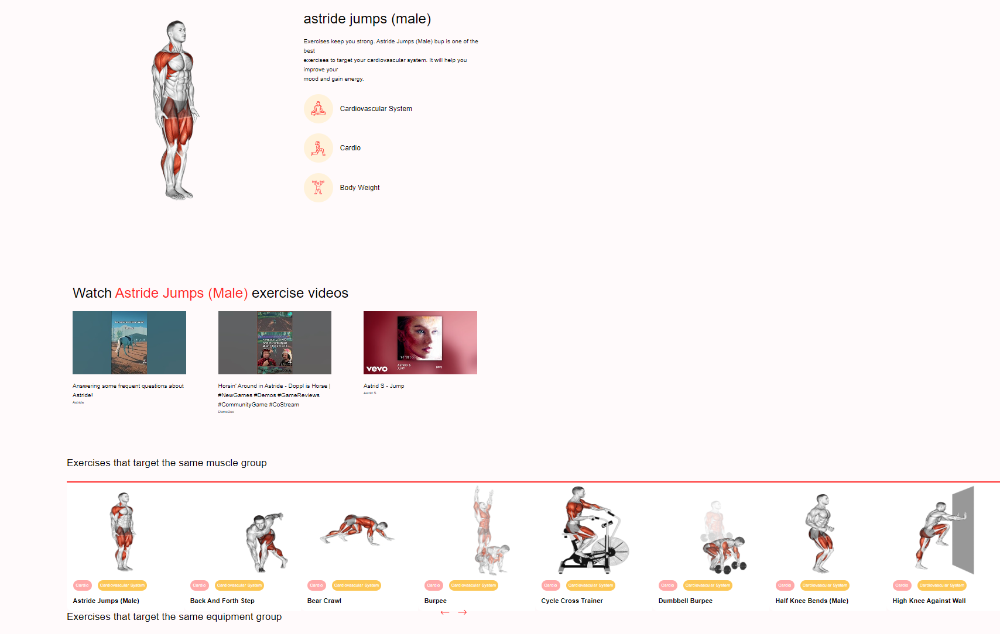

Part I:

1. Create app

   F:\reactjs\javascriptmastery\gym_exercise>npx create-react-app ./

2. Delete the content of src folder and create a new one
3. Add relative dependencies in package.json and install.

   F:\reactjs\javascriptmastery\gym_exercise>npm install --legacy-peer-deps

{
"name": "gym_exercise",
"version": "0.1.0",
"private": true,
"dependencies": {
"@emotion/react": "^11.11.1",
"@emotion/styled": "^11.11.0",
"@mui/icons-material": "^5.14.3",
"@mui/material": "^5.14.3",
"react": "^18.2.0",
"react-dom": "^18.2.0",
"react-horizontal-scrolling-menu": "^4.1.0",
"react-loader-spinner": "^5.3.4",
"react-router-dom": "^6.14.2",
"react-scripts": "^5.0.1"
},
"scripts": {
"start": "react-scripts start",
"build": "react-scripts build",
"test": "react-scripts test",
"eject": "react-scripts eject"
},
"eslintConfig": {
"extends": ["react-app", "react-app/jest"]
},
"browserslist": {
"production": [">0.2%", "not dead", "not op_mini all"],
"development": [
"last 1 chrome version",
"last 1 firefox version",
"last 1 safari version"
]
},
"devDependencies": {
"eslint": "^8.13.0",
"eslint-config-airbnb": "^19.0.4",
"eslint-plugin-import": "^2.26.0",
"eslint-plugin-jsx-a11y": "^6.5.1",
"eslint-plugin-react": "^7.29.4",
"eslint-plugin-react-hooks": "^4.4.0",
"@babel/plugin-proposal-private-property-in-object": "^7.21.11"
}
}

5. Add index.js, App.jsx, components folder, pages folder, and other components to the src directory.

1. Start the app

   F:\reactjs\javascriptmastery\gym_exercise>npm start

Part II:

CelebrityBanner: top bar.

Home: the main page, includes CelebrityBanner, SearchExercise, and Exercises components.

SearchExercise:

Exercises: The content of exercise, including pagination

ExerciseCard: Every exercise that listed in the Exercises components.

ExerciseDetail: The details of each ExercieCard, including Detail, SimilarExercise, ExerciseVideo components.

ExerciseVideo: Play the video content.

SimilarExercise: Display the same target or same equipment group

